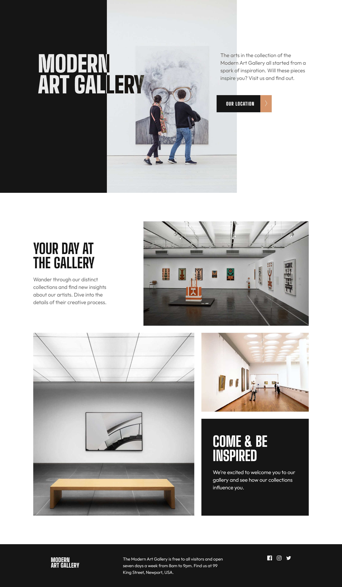

# Frontend Mentor - Art gallery website solution

This is a solution to the [Art gallery website challenge on Frontend Mentor](https://www.frontendmentor.io/challenges/art-gallery-website-yVdrZlxyA). Frontend Mentor challenges help you improve your coding skills by building realistic projects.

## Table of contents

- [Overview](#overview)
  - [The challenge](#the-challenge)
  - [Screenshot](#screenshot)
  - [Links](#links)
- [My process](#my-process)
  - [Built with](#built-with)
- [Author](#author)

## Overview

### The challenge

Users should be able to:

- View the optimal layout for each page depending on their device's screen size
- See hover states for all interactive elements throughout the site

### Screenshot

### Links

- Solution URL: [https://www.frontendmentor.io/challenges/art-gallery-website-yVdrZlxyA/hub/art-gallery-site-CkmRXbXH7\_](https://www.frontendmentor.io/challenges/art-gallery-website-yVdrZlxyA/hub/art-gallery-site-CkmRXbXH7_)
- Live Site URL: [https://art-gallery-cyan-five.vercel.app/](https://art-gallery-cyan-five.vercel.app/)

## My process

### Built with

- Semantic HTML5 markup
- CSS custom properties
- Flexbox
- CSS Grid
- Mobile-first workflow

## Author

- Website - [Eseoghene Alli](https://esealli.github.io/)
- Frontend Mentor - [@EseAlli](https://www.frontendmentor.io/profile/EseAlli)
